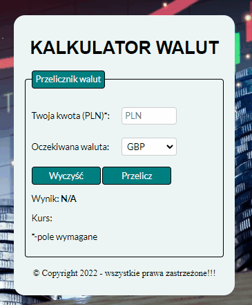

# Projektowanie konstrukcjii budowlanych - my first page
## Description
This is one of my first websites created as homework in a programming course. The website contains basic information about the scope of services and implementation of the company.
It presents the composition of the company as well as contact information.

## DEMO:
https://pawelmajka.github.io/Projektowanie-konstrukcjii/

## Prieview

## Used technologies:
- HTML
- CSS
- JavaScript
- BEM convension
- normalize.css